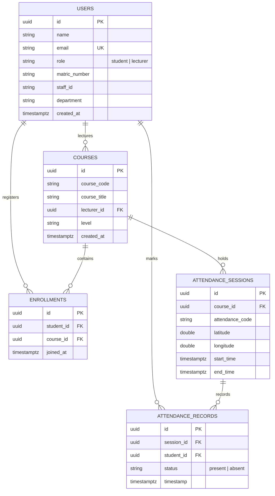

# SmartAttend 🎓

[](https://expo.dev)
[](https://reactnative.dev)
[](https://www.typescriptlang.org)
[](https://neon.tech)
[](LICENSE)

> **SmartAttend** is a modern, cross-platform mobile attendance management system built for universities and educational institutions. It completely eliminates proxy attendance through **dynamic QR code generation & scanning** paired with **GPS geofence validation** using the spherical **Haversine formula**.

---

## 📌 Table of Contents

- [Overview](#-overview)
- [Key Features](#-key-features)
  - [Student Features](#student-features)
  - [Lecturer Features](#lecturer-features)
  - [Verification & Reliability](#verification--reliability)
- [Architecture & Tech Stack](#-architecture--tech-stack)
- [Project Directory Structure](#-project-directory-structure)
- [Database Architecture](#-database-architecture)
- [Geofencing Engine (Haversine Formula)](#-geofencing-engine-haversine-formula)
- [Getting Started](#-getting-started)
  - [Prerequisites](#prerequisites)
  - [Environment Variables](#environment-variables)
  - [Installation & Local Run](#installation--local-run)
- [Building Android APK (EAS Build)](#-building-android-apk-eas-build)
- [Exporting Reports](#-exporting-reports)
- [Contributing & License](#-license)

---

## 🚀 Overview

Traditional paper attendance sheets and static digital rosters suffer from buddy check-ins, delayed submissions, and manual error. **SmartAttend** resolves these problems by providing an automated, role-aware mobile application:

1. **Lecturers** schedule an attendance session for a registered course. The app records the lecturer's precise GPS coordinates and generates an encrypted, time-limited QR code.
2. **Students** scan the QR code using their device camera.
3. The app fetches the student's real-time GPS location and computes the great-circle distance between the student and lecturer. If the student is physically within the authorized geofence radius (e.g. 50 meters), attendance is marked as **Present**; otherwise, check-in is rejected.
4. **Push Notifications** notify students whenever a session is opened for their enrolled courses so they never miss roll call.
5. **CSV Export** enables lecturers to generate spreadsheet-ready attendance records with one tap.

---

## ✨ Key Features

### Student Features

- **Smart Dashboard**: Real-time overview of enrolled courses, total attendance percentage, and current-week attendance tally.
- **Course Catalog & Enrollment**: Search and filter available courses by academic department and level (100–500L).
- **Automated Course Alerts**: Prompts student on enrollment to enable notifications, instantly dispatching push alerts when attendance sessions open.
- **QR & Geofence Check-in**: Integrated high-speed camera scanner with instant geolocation verification and haptic feedback.
- **Attendance History**: Historical ledger of all attended classes categorized by course code, date, and status.
- **Personalized Profile**: Native initials avatar generator, contact info, and theme switch (Light, Dark, System default).

### Lecturer Features

- **Lecturer Control Center**: High-level metrics tracking total students reached, average attendance rate across courses, and active sessions.
- **Course Management**: Create new courses with course code, title, department, level, and credit unit specifications.
- **Dynamic Session Launcher**:
  - Automatically captures class hall GPS latitude & longitude.
  - Configurable expiration timer.
  - Real-time QR Code rendering with dynamic rotation support.
- **Live Attendance Monitor**: Real-time counter and attendee roster as students check in during class.
- **Export to CSV**: Instant RFC 4180-compliant CSV download and mobile sharing for course-specific rosters or institute-wide semester reports.

### Verification & Reliability

- **Haversine Geofencing**: Mathematical validation ensures students are physically located in the lecture hall.
- **Offline Error Interceptor**: Detects network dropouts and DNS failures, displaying user-friendly connection prompts instead of raw database errors.
- **Secure Storage**: Sessions, auth tokens, and preferences safely preserved with `expo-secure-store`.

---

## 🛠 Architecture & Tech Stack

| Layer              | Technology                                                                     | Purpose                                                        |
| :----------------- | :----------------------------------------------------------------------------- | :------------------------------------------------------------- |
| **Framework**      | [React Native 0.86](https://reactnative.dev) / [Expo SDK 57](https://expo.dev) | Cross-platform native mobile runtime                           |
| **Routing**        | [Expo Router](https://docs.expo.dev/router/introduction/)                      | Type-safe, file-based routing with deep linking                |
| **Database**       | [Neon Serverless Postgres](https://neon.tech)                                  | Scalable Postgres accessed via serverless HTTP driver          |
| **Authentication** | [Neon Better Auth](https://neon.tech/docs/guides/neon-auth) / SecureStore      | Token-based auth supporting Email, Matric Number, and Staff ID |
| **Hardware APIs**  | `expo-camera`, `expo-location`, `expo-haptics`                                 | Camera QR scanning, GPS geolocation, and tactile feedback      |
| **Notifications**  | `expo-notifications`                                                           | Push and local notification channels for class session alerts  |
| **Export Engine**  | `expo-file-system`, `expo-sharing`                                             | In-memory CSV compilation and native share sheet triggering    |
| **UI & Icons**     | Vanilla StyleSheet & Lucide React Native                                       | Fluid, responsive layouts with Dark / Light theme tokens       |
| **Build System**   | [Expo Application Services (EAS)](https://expo.dev/eas)                        | Cloud and local Android APK compilation                        |

---

## 📂 Project Directory Structure

```text
attendance-app/
├── app.json                     # Expo configuration, plugins, permissions & icons
├── eas.json                     # EAS Build configuration (preview & production APKs)
├── package.json                 # Project dependencies & scripts
├── neon_schema.sql              # Neon PostgreSQL table definitions & indexes
├── haversine.md                 # Mathematical specification of the geofencing algorithm
│
├── assets/images/               # App branding assets
│   ├── icon.png                 # Main 1024x1024 app icon
│   ├── android-icon-foreground.png
│   ├── android-icon-background.png
│   └── splash-icon.png
│
└── src/
    ├── app/                     # Expo Router navigation tree
    │   ├── _layout.tsx          # Root provider stack (Theme, Auth, Notifications)
    │   ├── index.tsx            # Initial role-based redirect
    │   ├── (auth)/              # Authentication screens
    │   │   ├── login.tsx        # Login supporting Matric No, Staff ID, or Email
    │   │   └── register.tsx     # Role-aware registration (Student vs Lecturer)
    │   ├── (student)/           # Student screens
    │   │   ├── index.tsx        # Student dashboard & active session reminders
    │   │   ├── enroll.tsx       # Course search & enrollment with notification prompt
    │   │   ├── mark.tsx         # Camera QR scanner & GPS distance check
    │   │   ├── history.tsx      # Attendance history
    │   │   ├── notifications.tsx# In-app notification center
    │   │   └── profile.tsx      # Profile, notification permissions & theme toggle
    │   └── (lecturer)/          # Lecturer screens
    │       ├── index.tsx        # Lecturer analytics & courses
    │       ├── create-course.tsx# Course builder
    │       ├── course/[id].tsx  # Course detail, session creation & QR code display
    │       ├── reports.tsx      # CSV Export & attendance summaries
    │       └── profile.tsx      # Lecturer settings
    │
    ├── context/                 # Global React contexts
    │   ├── AuthContext.tsx      # User profile, role state, and session hydration
    │   ├── NotificationContext.tsx # Push notification permission & session polling
    │   └── ThemeContext.tsx     # Light/Dark/System theme controller
    │
    └── lib/                     # Core utilities & database clients
        ├── auth.ts              # Neon Better Auth endpoints & error normalizer
        ├── exportCsv.ts         # RFC 4180 CSV builder & file exporter
        ├── neon.ts              # Serverless Neon Postgres HTTP client & query builder
        ├── notifications.ts     # Android channels, permission prompts & notification dispatch
        └── supabase.ts          # Backward-compatible database client abstraction
```

---

## 🗄 Database Architecture

The system schema is configured in [neon_schema.sql](file:///c:/Users/Mosopefoluwa/Documents/Mosope/Code/school/attendance-app/neon_schema.sql) and runs directly on **Neon PostgreSQL**:



---

## 🌐 Geofencing Engine (Haversine Formula)

To prevent off-site check-ins, the app computes the great-circle distance between the student's GPS coordinate $(\phi_1, \lambda_1)$ and the lecturer's lecture hall coordinate $(\phi_2, \lambda_2)$:

$$a = \sin^2\left(\frac{\Delta\phi}{2}\right) + \cos(\phi_1)\cos(\phi_2)\sin^2\left(\frac{\Delta\lambda}{2}\right)$$

$$c = 2 \cdot \text{atan2}\left(\sqrt{a}, \sqrt{1-a}\right)$$

$$d = R \cdot c$$

Where:

- $R \approx 6,371,000 \text{ meters}$ (mean radius of Earth)
- $\Delta\phi = \phi_2 - \phi_1$ (latitude difference in radians)
- $\Delta\lambda = \lambda_2 - \lambda_1$ (longitude difference in radians)
- $d \le \text{Threshold}$ (default is **50 meters**)

If $d \le 50\text{m}$, the scan proceeds and the attendance record is inserted into Neon DB; otherwise, the app alerts the student that they are outside the lecture hall.

---

## 📦 Getting Started

### Prerequisites

- [Node.js](https://nodejs.org) (v18 or LTS recommended)
- [npm](https://www.npmjs.com) or [yarn](https://yarnpkg.com)
- [Expo Go app](https://expo.dev/go) or Android Emulator / physical device

### Environment Variables

Create a `.env` file in the root directory:

```env
# Neon Serverless Postgres HTTP connection string (Compute endpoint)
EXPO_PUBLIC_NEON_DATABASE_URL=postgresql://<user>:<password>@ep-example.c-7.us-east-2.aws.neon.tech/neondb?sslmode=require

# Neon Better Auth API URL
EXPO_PUBLIC_NEON_AUTH_URL=https://ep-example.neonauth.c-7.us-east-2.aws.neon.tech/neondb/auth
```

> **Note**: For local HTTP query execution, ensure the database URL points to the compute host without `-pooler`.

### Installation & Local Run

1. **Clone the repository**:

   ```bash
   git clone https://github.com/Mosope16/attendance-app.git
   cd attendance-app
   ```

2. **Install dependencies**:

   ```bash
   npm install
   ```

3. **Start the development server**:

   ```bash
   npx expo start
   ```

4. **Run on your device**:
   - Press `a` in the terminal for **Android Emulator**.
   - Press `w` for **Web**.
   - Scan the terminal QR code with the **Expo Go** app on your phone.

---

## 📱 Building Android APK (EAS Build)

The project includes an `eas.json` file pre-configured to output standalone `.apk` packages for distribution:

1. **Install EAS CLI globally**:

   ```bash
   npm install --global eas-cli
   ```

2. **Log into your Expo account**:

   ```bash
   eas login
   ```

3. **Build the preview APK**:
   ```bash
   eas build -p android --profile preview
   ```
   EAS will compile the native Android bundle in the cloud and return a direct download link for the standalone APK.

---

## 📊 Exporting Reports

Lecturers can export attendance sheets in standard CSV format at any time:

1. Navigate to **Reports** from the lecturer dashboard or open any **Course Details** screen.
2. Select **Export to CSV**.
3. The app compiles all check-ins with:
   - Student Full Name
   - Matric Number / Staff ID
   - Department
   - Session Date & Time
   - Status (Present / Absent)
4. The file is saved locally to device storage and the native Android/iOS share sheet opens automatically to send via Email, WhatsApp, Google Drive, or Slack.

---

## 📄 License

This project is licensed under the [MIT License](LICENSE).
